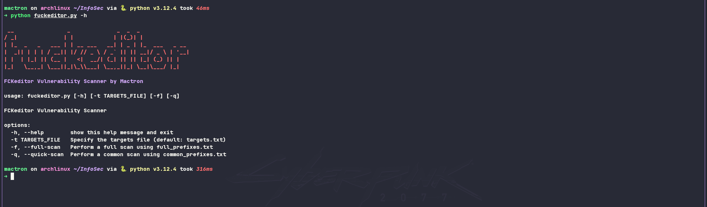
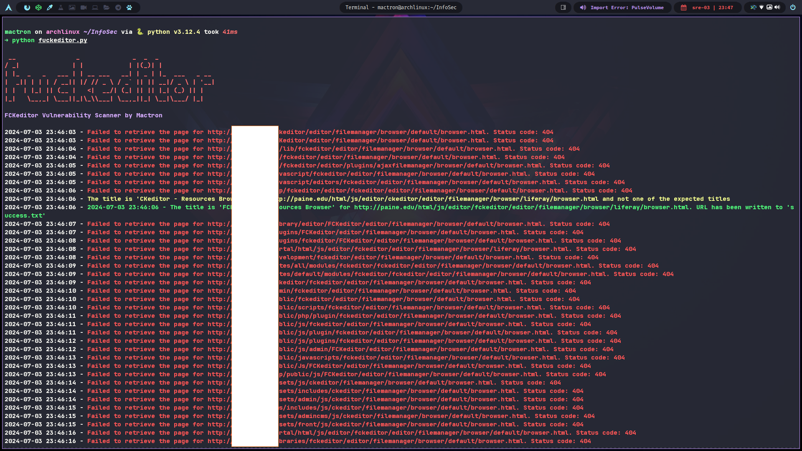

# fuckeditor - FCKeditor Vulnerability Scanner



A vulnerability scanner for an old FCKeditor, capable of detecting specific titles indicative of vulnerable installations.

## Table of Contents
- [Overview](#overview)
- [Features](#features)
- [Prerequisites && Installation](#prerequisitesinstallation)
- [Usage](#usage)
- [Results](#results)
- [Disclaimer](#disclaimer)


## Overview

Cyber threat actors are exploiting a CMS editor, FCKeditor, discontinued 14 years ago, to compromise educational and government entities on a global scale. Exploiting open redirects in the editor, attackers perform phishing, malware distribution, and scams, deceiving users with seemingly legitimate domains. As open redirects use trusted domains, they can evade security filters and gain visibility in search engine results, making them effective in SEO poisoning campaigns. Despite not hosting malicious content directly, these open redirects persist in search results until reported for takedown.

There are numerous websites that still use the outdated FCKEditor, which is plagued by various vulnerabilities, including "Arbitrary File Upload", "Remote Code Execution (RCE)" and Cross-Site Scripting (XSS)". These vulnerabilities allow remote attackers to execute arbitrary code by creating a PHP file and to inject arbitrary web scripts or HTML via components in FCKEditor samples.

References: [CVE-2008-6178](https://www.cvedetails.com/cve/CVE-2008-6178/), [CVE-2009-2265](https://www.cvedetails.com/cve/CVE-2009-2265/), [CVE-2009-2324](https://www.cvedetails.com/cve/CVE-2009-2324/)

To assess potential risks, this Python script scans a list of target URLs for instances of FCKEditor and identifies vulnerabilities based on the titles of returned pages.

## Features

**Performs scans using two methods:**

- **Quick Scan:** Utilizes a predefined list of common prefixes to explore potentially vulnerable locations.
- **Full Scan (Optional):** Employs a more extensive list of prefixes for a more thorough check, but may take longer.

**Outputs results:**

- **Successes:** URLs indicating a vulnerable FCKeditor installation are written to a success.txt file.
- **Informative messages:** Provides feedback on the scan progress and encountered issues.

**Error handling:**
- Catches connection timeouts and gracefully skips those URLs.
- Handles general request exceptions and logs them for debugging.

## Prerequisites && Installation

### Prerequisites:
```bash
Python 3 (tested with 3.x on ArchLinux, & KaliLinux)
```

**Required libraries:**
```bash
requests
argparse
beautifulsoup4
colorama (optional for colored output)
urllib3 (may be included with requests)
```

### Installation:

```bash
git clone https://github.com/mactronmedia/fuckeditor.git
cd fuckeditor
pip install -r requirements.txt
```

## Usage
```bash
usage: fuckeditor.py [-h] [-t TARGETS_FILE] [-f] [-q]

FCKeditor Vulnerability Scanner

options:
  -h, --help        show this help message and exit
  -t TARGETS_FILE   Specify the targets file (default: targets.txt)
  -f, --full-scan   Perform a full scan using full_prefixes.txt
  -q, --quick-scan  Perform a common scan using common_prefixes.txt
```

### Example
```bash
python fuckeditor.py -t targets.txt -f 
```

## Results



## Disclaimer
**Running "fuckeditor" against websites without prior mutual consent may be illegal in your country. I accept no liability and am not responsible for any misuse or damage caused by "fuckeditor".**


