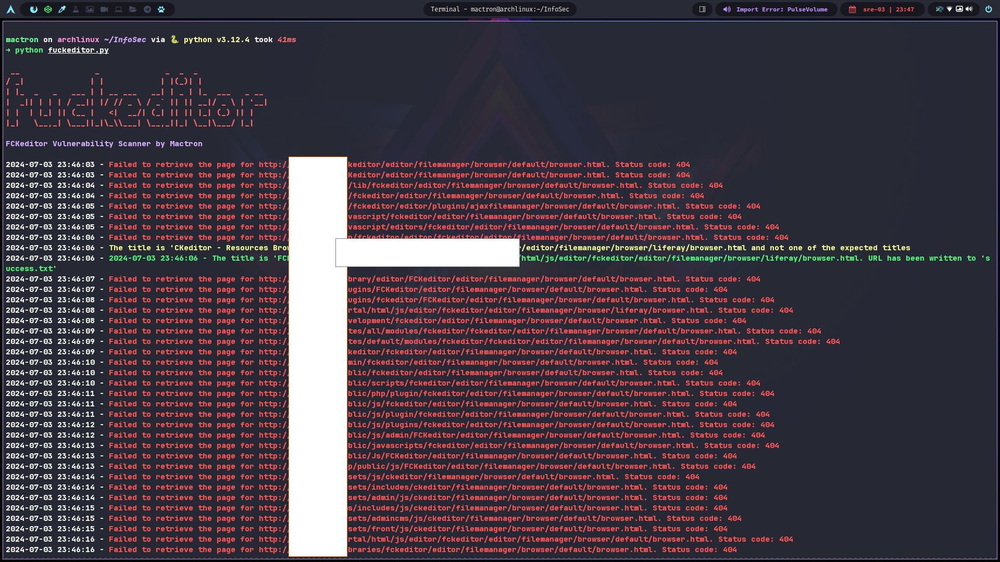

# fuckeditor - FCKeditor Vulnerability Scanner


A vulnerability scanner for an old FCKeditor, capable of detecting specific titles indicative of vulnerable installations.

## Table of Contents
- [Overview](#overview)
- [Features](#features)
- [Installation](#installation)
- [Usage](#usage)
- [Options](#options)
- [Results](#results)

## Overview
This Python script scans a list of target URLs for FCKeditor instances and identifies potential vulnerabilities based on the title of the returned pages. 

There are numerous websites that still use the outdated FCKEditor, which is plagued by various vulnerabilities, including "Arbitrary File Upload", "Remote Code Execution (RCE)" and Cross-Site Scripting (XSS)". 

FCKEditor allows remote attackers to execute arbitrary code by creating a PHP file, and it also permits them to inject arbitrary web scripts or HTML via components in its samples.

References: CVE-2009-2265, CVE-2008-6178, CVE-2009-2324

## Features

**Performs scans using two methods:**

- **Quick Scan:** Utilizes a predefined list of common prefixes to explore potentially vulnerable locations.
- **Full Scan (Optional):** Employs a more extensive list of prefixes for a more thorough check, but may take longer.

**Outputs results:**

- **Successes:** URLs indicating a vulnerable FCKeditor installation are written to a success.txt file.
- **Informative messages:** Provides feedback on the scan progress and encountered issues.

**Error handling:**
- Catches connection timeouts and gracefully skips those URLs.
- Handles general request exceptions and logs them for debugging.

## Prerequisites && Installation

### Prerequisites:
```bash
Python 3 (tested with 3.x on ArchLinux, & KaliLinux)
```

**Required libraries:**
```bash
requests
argparse
beautifulsoup4
colorama (optional for colored output)
urllib3 (may be included with requests)
```

### Installation:

```bash
git clone https://github.com/mactronmedia/fuckeditor.git
cd fuckeditor
pip install -r requirements.txt
```

## Usage

-t TARGETS_FILE: Specify the targets file (default: targets.txt).
-f, --full-scan: Perform a full scan using full_prefixes.txt.
-q, --quick-scan: Perform a common scan using common_prefixes.txt.

```bash
python fuckeditor.py [-h] [-t TARGETS_FILE] [-f] [-q]
```

## Results




